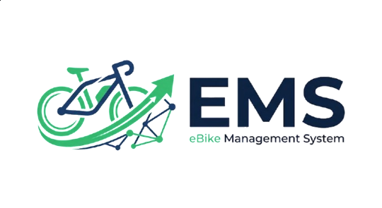

  

## 1. Resumen Ejecutivo

Desarrollador de software en etapa técnica y formativa con conocimientos en el ciclo de vida del software (SDLC), diseño de bases de datos relacionales y desarrollo web. Especializado en **PHP**, **JavaScript**, **HTML/CSS** y **SQL**, con enfoque en calidad de software, estándares internacionales (ISO) y control de versiones con Git/GitHub.

Destaco por una mentalidad analítica orientada a la resolución de problemas técnicos, optimización de consultas en BD y desarrollo modular. Cuento con experiencia en la gestión e implementación de proyectos integrales, desde el modelado de datos hasta el desarrollo de paneles interactivos.

---

## 2. Proyecto Destacado

### **eBike Management System (EMS)**

* **Desafío:** Sistema de gestión de alquileres, mantenimiento y registro transaccional de bicicletas compartidas.
* **Rol:** Diseñador de Base de Datos y Desarrollador Backend/Frontend.
* **Tecnologías:** PHP, MySQL/MariaDB, JavaScript, HTML5, CSS3, Git.
* **Resultado:** Implementación exitosa del esquema de datos, dashboard interactivo y flujo de alquiler funcional.

  

---

## 3. Educación y Formación

* **Técnico / Aprendiz en Desarrollo de Software**
  * *Énfasis:* Ingeniería de Software, Programación Web y Bases de Datos Relacionales.
* **Formación Complementaria:**
  * Calidad de Software bajo Estándares ISO (12207, 25010, 90003).
  * Lógica de Programación y Estructuras Algorítmicas.

---

## 4. Competencias Técnicas

* **Lenguajes:** PHP, JavaScript (ES6+), SQL, PSeInt (Pseudocódigo).
* **Frontend:** HTML5, CSS3, Interfaces UI/UX adaptativas.
* **Backend & Bases de Datos:** PHP, MySQL, MariaDB, Modificación de Esquemas, Claves FK/PK, Restricciones.
* **Herramientas:** VS Code, XAMPP, Git, GitHub, Terminal / CLI.
* **Estándares:** SDLC, ISO/IEC 12207, ISO/IEC 25010, ISO 90003, Modelado ER.

  
  
  
  

---

## 5. Experiencia Profesional

### **Aprendiz / Desarrollador Junior (Proyecto Formativo)**
*eBike Management System (EMS)* | **2025 – Presente**

* **Diseño de Arquitectura de Datos:** Diseñé e implementé la estructura relacional para la gestión de bicicletas compartidas (tablas de alquileres, mantenimiento y transacciones con PK/FK e índices `TIMESTAMP` y `SERIAL`).
* **Desarrollo Backend:** Creé scripts en PHP para lógica de negocio, validaciones y conexión con MySQL/MariaDB.
* **Control de Versiones y Entornos:** Gestión de ramas y resolución de conflictos en Git/GitHub. Configuración de entornos locales en XAMPP y VS Code.
* **Calidad de Software:** Aplicación de normativas ISO/IEC 12207 e ISO/IEC 25010 en el proceso de desarrollo.

---

## 6. Habilidades Blandas

<table>
  <tr>
    <td align="center" valign="middle" width="30%">
      
    </td>
    <td valign="middle">
      <ul>
        <li><b>Pensamiento Analítico:</b> Descomposición eficiente de problemas lógicos.</li>
        <li><b>Resolución Autónoma:</b> Diagnóstico y solución de fallas en entornos locales y código.</li>
        <li><b>Orientación a la Calidad:</b> Código limpio, mantenible y alineado a estándares ISO.</li>
        <li><b>Aprendizaje Continuo:</b> Adopción constante de tecnologías y herramientas.</li>
      </ul>
    </td>
  </tr>
</table>

